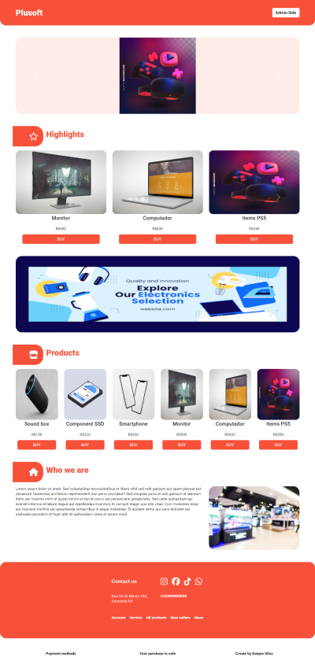
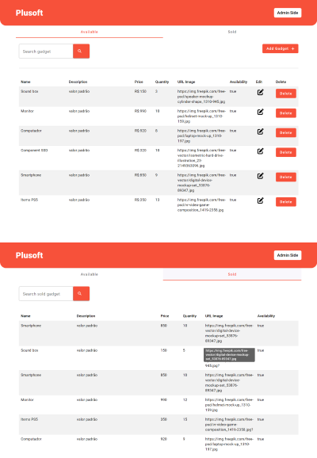
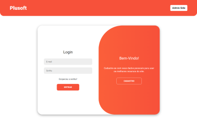
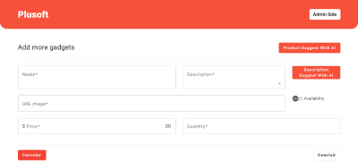

# 
Plusoft 
 
Case Técnico - WebSite

#  Sobre o projeto

Este projeto é um website que apresenta produtos tecnológicos à venda, com carrosséis e banners. Além do site ter a parte para clientes comprar produtos, possui uma seção administrativa onde os administradores podem realizar operações CRUD nos produtos do site, utilizando também IA para ajuda do usuário admnistrativo na hora da criação de novos produtos. Para acessar a seção administrativa, é necessário a execução de login.
A linguagem usada para a criação foi o Typescript, usando Angular e Node.js, e no banco de dados foi utilizado o PostgreSQL.

#  Pré-requisitos

* Ter um desses sistemas operacionais `<Windows / Linux / Mac>` 
* Node.js

# Introduções para execução

* Instale o `PostgreSQL` em sua máquina.
* Configure o banco de dados passando os dados para o arquivo `data-source` dentro de `backend/src/data-source`.
* Execute `npm install` tanto para o frontend quanto para o backend.
* Com isso configurado, você já pode utilizar a aplicação.

# Tecnologias Utilizadas
Frontend
* Angular: Escolhido por sua robustez e eficiência na criação de aplicações SPA (Single Page Applications).
* Bootstrap e Angular Material: Usados para estilização e componentes de interface do usuário.
* jQuery: Utilizado para manipulação do DOM e simplificação de tarefas comuns de JavaScript.
* ng-bootstrap: Utilizado para integrar o Bootstrap com o Angular.
* Font Awesome: Usado para adicionar ícones atraentes ao site.

Backend
* Node.js e Express: Escolhidos pela eficiência em lidar com várias solicitações simultâneas e pela facilidade de integração com várias bibliotecas e frameworks.
* TypeORM: Usado para abstrair a interação com o banco de dados PostgreSQL.
* UUID: Utilizado para gerar IDs únicos para os produtos.
* bcrypt: Usado para criptografar senhas de usuários para segurança.
* Generative-AI: Utilizado para gerar sugestões de produtos e descrições.

# Decisão do Projeto

A arquitetura do projeto foi cuidadosamente planejada para garantir eficiência, escalabilidade e facilidade de manutenção. Com a comunicação fluída do frontend com o backend, por meio da chamada http, o backend recebe, se comunica com o banco de dados, o banco de dados retorna para ele e após isso o frontend tem sua resposta. A escolha do Angular para o frontend foi motivada por sua capacidade de criar aplicações SPA (Single Page Applications) eficientes e de alto desempenho. O Angular também oferece uma estrutura bem definida que facilita a organização do código e a manutenção do projeto.

No backend, foi optado pelo Node.js e Express por sua eficiência em lidar com várias solicitações simultâneas e pela facilidade de integração com várias bibliotecas e frameworks. A escolha do PostgreSQL para o banco de dados foi motivada por sua robustez, escalabilidade e recursos avançados.

A integração da API de IA do Google (Gemini) é uma característica distintiva do projeto. Ela permite que, ao criar um novo produto, você possa pedir uma sugestão que a IA retornará um produto, assim também tem apenas para gerar uma descrição caso precise. Esta funcionalidade aumenta a eficiência do processo de adição de novos produtos e oferece uma experiência de usuário mais interativa.

# Telas de Apresentação

    
Telas

  

    
    
    
    
  

# Vídeo Demonstrativo 

https://github.com/kaiquemsa/plusoft_case/assets/94807101/7f67767a-1947-4624-8e25-4e47bec054e3

